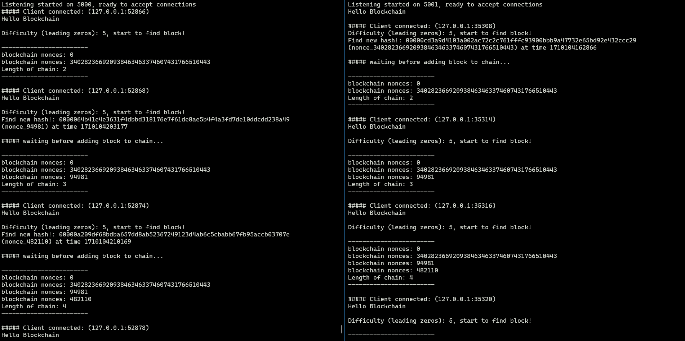

# PoW Blockchain in Rust



## 1. basic_pow.rs
### To start: 
```bash
> terminal
cargo run --config config.toml
```

bitcoin header (simplified): 
| Size | Field | Description |
| - | - | - |
|4 bytes|Version|A version number to track software/protocol upgrades|
|32 bytes|Previous Block Hash|A reference to the hash of the previous (parent) block in the chain|
|4 bytes|Timestamp|The approximate creation time of this block (seconds from Unix Epoch)|
|4 bytes|Difficulty Target|The proof-of-work algorithm difficulty target for this block|
|4 bytes|Nonce|A counter used for the proof-of-work algorithm|

### Caveat
1. Leading zeros are set to difficulty level to ensure smooth operation (because they are clearly visible)  
원활한 작동 확인을 위해 Leading zeros를 난이도로 설정함 (시각적으로 명확하게 보이기 때문)

2. Bitcoin header is implemented separately as BitcoinBlockHeader  
비트코인의 헤더는 BitcoinBlockHeader로 별도로 구현

3. Use customized block structures and calculation formulas using various reference sites below  
아래 여러 참고 사이트를 활용하여 커스터마이징한 블록 구조와 계산 식을 활용함

### Reference
1. https://lhartikk.github.io/jekyll/update/2017/07/13/chapter2.html
2. https://medium.com/@lfoster49203/lets-create-a-cryptocurrency-in-rust-how-i-created-the-lyroncoin-cryptocurrency-a32a978030d4
3. https://blog.logrocket.com/how-to-build-a-blockchain-in-rust/


## 2. two_node_pow
### To start: 

```bash
> terminal 1
cargo run --config config.toml -- 5000 5001 "plus 1"

> another terminal 2
cargo run --config config.toml -- 5001 5000 "minus 1"
```

### How to work
STEP 1
: Start Listening peer node in async thread

STEP 2
: Connect to peer node

STEP 3
: Generate genesis block and start mining

STEP 4
: If node find a valid block, it sends block to peer and wait a several seconds to receive peer block

STEP 4-1
: If node receive a block from peer, it compare with own new block

STEP 4-2
: If not, it returns a its own block

STEP 5
: Add block to chain

---
### Accomplishments: 

1. Serialize/Deserialize block structure in JSON to byte array vice versa

2. PoW hash mining based on finding leading zeros difficulty

3. Select different nonce strategy 

4. Asynchronous TCP network communication and mining process

5. Inter thread communication using Arc and Mutex

### Not implemented
- Timing adjustment when two nodes generate same timestamp